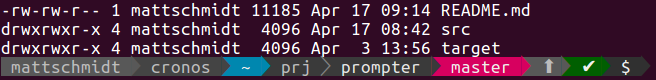

# Prompter - a prompt generator for Bash

This is a reimplementation of the great prompt generator [powerline-shell](https://github.com/b-ryan/powerline-shell) in the Rust programming language.

This is how it looks like:



It uses the **very same** configuration files as powerline-shell and implements many of the segment modules. Some are missing and I am happy to get pull requests. 

As of now it's limited to the Bash shell (since that's what I am using), but Pull-Requests for other shells are welcome.

- Shows some important details about the git branch (see below)
- Changes color if the last command exited with a failure code
- If you're too deep into a directory tree, shortens the displayed path with an ellipsis
- Very easy to customize and extend.
- Runs orders of magnitude faster than it's predecessor.

<!-- START doctoc generated TOC please keep comment here to allow auto update -->
<!-- DON'T EDIT THIS SECTION, INSTEAD RE-RUN doctoc TO UPDATE -->
**Table of Contents**  *generated with [DocToc](https://github.com/thlorenz/doctoc)*

- [Installation](#installation)
  - [Linux/Debian package](#linuxdebian-package)
  - [Mac OS X, brew installation](#mac-os-x-brew-installation)
  - [Install from the git repository:](#install-from-the-git-repository)
- [Git Version Control](#git-version-control)
- [Setup](#setup)
  - [Bash](#bash)
- [Customization](#customization)
  - [Config File](#config-file)
  - [Adding, Removing and Re-arranging segments](#adding-removing-and-re-arranging-segments)
  - [Generic Segments](#generic-segments)
  - [Segment Separator](#segment-separator)
  - [Themes](#themes)
  - [Segment Configuration](#segment-configuration)
- [Troubleshooting](#troubleshooting)

<!-- END doctoc generated TOC please keep comment here to allow auto update -->

## Installation

### Linux/Debian package

TODO

### Mac OS X, brew installation

TODO

### Install from the git repository:

```
git clone https://github.com/ms140569/prompter
cd prompter
make release
cp target/release/prompter <somewhere on your $PATH>
```

## Git Version Control

The git module gives you the following features:

- The current branch is displayed and changes background color when the
  branch is dirty.
- When the local branch differs from the remote, the difference in number
  of commits is shown along with `⇡` or `⇣` indicating whether a git push
  or pull is pending.

If files are modified or in conflict, the situation is summarized with the
following symbols:

- `✎` -- a file has been modified (but not staged for commit, in git)
- `✔` -- a file is staged for commit (git) or added for tracking
- `✼` -- a file has conflicts
- `?` -- a file is untracked

Each of these will have a number next to it if more than one file matches.

The segment can start with a symbol representing the version control system in
use. To show that symbol, the configuration file must have a variable `vcs`
with an option `show_symbol` set to `true` (see
[Segment Configuration](#segment-configuration)).

## Setup

This script uses ANSI color codes to display colors in a terminal. These are
notoriously non-portable, so may not work for you out of the box, but try
setting your $TERM to `xterm-256color`.

- Patch the font you use for your terminal: see
  [powerline-fonts](https://github.com/Lokaltog/powerline-fonts)
  - If you struggle too much to get working fonts in your terminal, you can use
    "compatible" mode.

- Setup your shell prompt using the instructions for your shell below.

### Bash

Add the following to your `.bashrc` file:

```
function _update_ps1() { PS1=$(prompter $?); }

if [[ $TERM != linux && ! $PROMPT_COMMAND =~ _update_ps1 ]]; then
    PROMPT_COMMAND="_update_ps1; $PROMPT_COMMAND"
fi
```

**Note:** On macOS, you must add this to one of `.bash_profile`, `.bash_login`,
or `.profile`. macOS will execute the files in the aforementioned order and
will stop execution at the first file it finds. For more information on the
order of precedence, see the section **INVOCATION** in `man bash`.

## Customization

### Config File

Prompter could be customized with a JSON file configuring the order and setup 
of the path segments. The configfile lookup-order and their names are:

1. $PWD/prompter.json
2. $HOME/.prompter.json
3. XDG_CONFIG_HOME/prompter/config.json
4. $HOME/.config/prompter/config.json

I this fails, the following default configuration will be used:

```
{                                                                                              
       "segments": [                              
           "username",                                                                                                                                                                           
           "hostname",                                                                            
           "exit_code",                                                                                                                                                                          
           "cwd",                                                                                                                                                                                
           "git",                              
           "jobs",                                                                                                                                                                               
           "root"                                 
       ]                                                                                          
   } 
```

You can dump-out this configuration into a file and use it as a template for further modifications: 

```
prompter --generate-config > ~/.prompter.json
```

You can find some example configurations in the sources.

### Adding, Removing and Re-arranging segments

Once you have generated your config file, you can now start adding or removing
"segments" - the building blocks of your shell. The list of segments available
can be seen
[here](src/segments).

You can also create custom segments. Start by copying an existing, simple segment like
[hostname](src/segments/hostname.rs).

TODO: description how to hook-up new segment.


### Generic Segments

There are two special segments available. `stdout` accepts an arbitrary command
and the output of the command will be put into your prompt. `env` takes an
environment variable and the value of the variable will be set in your prompt.
For example, your config could look like this:

```
{
  "segments": [
    "cwd",
    "git",
    {
      "type": "stdout",
      "command": ["echo", "hi"],
      "fg_color": 22,
      "bg_color": 161
    },
    {
      "type": "env",
      "var": "DOCKER_MACHINE_NAME",
    },
  ]
}
```

### Segment Separator

By default, a unicode character (resembling the > symbol) is used to separate
each segment. This can be changed by changing the "mode" option in the config
file. The available modes are:

- `patched` - The default.
- `compatible` - Attempts to use characters that may already be available using
  your chosen font.
- `flat` - No separator is used between segments, giving each segment a
  rectangular appearance (and also saves space).

### Themes

The `src/themes` directory stores themes for your prompt, which are
basically color values used by segments. The `default.rs` defines a default
theme.

TODO: Description how to hook-up another theme.


You can then modify the color codes to your liking. Theme colors are specified
using [Xterm-256 color codes](https://jonasjacek.github.io/colors/).

A script for testing color combinations is provided at `colortest.py`: 

```
./colortest.py 150 154  344  366 STRING
```

Note that the colors you see may vary depending on your terminal. When designing a
theme, please test your theme on multiple terminals, especially with default
settings.

### Segment Configuration

Some segments support additional configuration. The options for the segment are
nested under the name of the segment itself. For example, all of the options
for the `cwd` segment are set in `~/.prompter.json` like:

```
{
    "segments": [...],
    "cwd": {
        options go here
    }
    "theme": "theme-name",
    "vcs": {
        options go here
    }
}
```

The options for the `cwd` segment are:

- `mode`: If `plain`, then simple text will be used to show the cwd. If
  `dironly`, only the current directory will be shown. Otherwise expands the
  cwd into individual directories.
- `max_depth`: Maximum number of directories to show in path.
- `max_dir_size`: Maximum number of characters displayed for each directory in
  the path.
- `full_cwd`: If true, the last directory will not be shortened when
  `max_dir_size` is used.

## Troubleshooting

Run the debug build of prompter:

```
make test && make build
```

And run it like this:

```
RUST_LOG=debug RUST_BACKTRACE=1 target/debug/prompter 0
```

If you are facing issues, file them [HERE](https://github.com/ms140569/prompter/issues/new).
